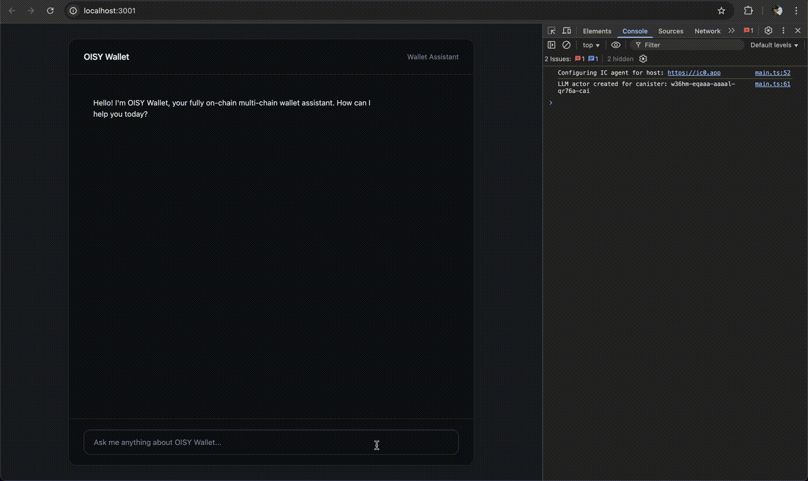

# OISY Console

OISY Console is an interactive demo showcasing how OISY Wallet's AI assistant could work. It features a chat interface that connects directly to an LLM canister on the Internet Computer, demonstrating how users can get AI-powered help with wallet operations and blockchain interactions. This demo is designed for exploring the technology and understanding its capabilities.



## Architecture

```
Browser → OISY Frontend → LLM Canister (Internet Computer)
```

The application uses a direct connection approach:
- **Frontend**: Vite + TypeScript application (off-chain)
- **Backend**: Direct connection to mainnet LLM canister (`w36hm-eqaaa-aaaal-qr76a-cai`)

## 📋 Prerequisites

- **Node.js** (version 18 or higher)
- **npm** package manager
- **just** command runner

## Quick Start

### 1. Clone and Install

```bash
git clone <repository-url>
cd oisy-console
npm install
```

### 2. Development

Start the development server:

```bash
# Using just (recommended)
just start
```

The application will be available at `http://localhost:3001`
